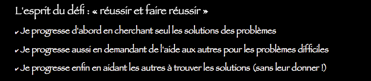

================
Le "Défi - Code"
================

Nous vous proposons dans cette section un "défi - code" composé d'une série de problèmes à résoudre dans l'ordre. Ce défi est ouvert **jusqu'au dimanche 12 avril à minuit!**

.. attention:: Pour résoudre ces problèmes vous devez utiliser **uniquement les concepts vus en cours**. Ce qui n'est pas dans le cours est donc formellement interdit sous peine de disqualification.

.. note :: Les résultats des participants seront publiés `--> ICI <-- <http://vps750508.ovh.net/docs/intropythonunc/en/latest/Resultats.html>`_ et mis à jour régulièrement (chaque soir a minima).

.. include::  exercicesDefiCode/ProduitScalaire.rst
.. include::  exercicesDefiCode/MotPalindrome.rst
.. include::  exercicesDefiCode/CompteChiffre.rst
.. include::  exercicesDefiCode/PhrasePalindrome.rst
.. include::  exercicesDefiCode/SousChaine.rst
.. include::  exercicesDefiCode/ElemSuiteArithmetique.rst
.. include::  exercicesDefiCode/ElemSuiteGeometrique.rst
.. include::  exercicesDefiCode/VerifSuiteAriGeo.rst
.. include::  exercicesDefiCode/SuiteArithmetique.rst
.. include::  exercicesDefiCode/SuiteGeometrique.rst
.. include::  exercicesDefiCode/SuiteAriGeo.rst
.. include::  exercicesDefiCode/Conway.rst
